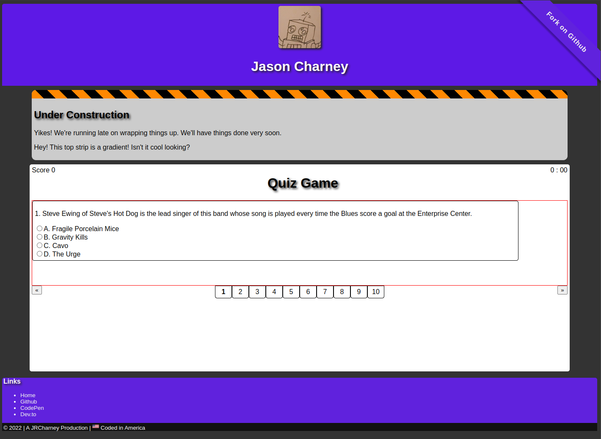

# Code Quiz

Module 4 Challenge

[](https://jrcharney.github.io/code-quiz/)

## User Story

```
AS A coding boot camp student
I WANT to take a timed quiz on JavaScript fundamentals that stores high scores
SO THAT I can gauge my progress compared to my peers
```

## Acceptable Criteria

```
GIVEN I am taking a code quiz
WHEN I click the start button
THEN a timer starts and I am presented with a question
WHEN I answer a question
THEN I am presented with another question
WHEN I answer a question incorrectly
THEN time is subtracted from the clock
WHEN all questions are answered or the timer reaches 0
THEN the game is over
WHEN the game is over
THEN I can save my initials and score
```

## Todo List

* [ ] Create a start button that, when clicked, starts a timer with a question.
* [ ] Upon clicking on an answer, present another question
* [ ] Deduct time from the countdown timer if a question is answered incorrectly.
* [ ] End the game when all the questions are answered or time runs out.
* [ ] Save initials and score when the game is over.
* [x] Take a screenshot of the project
* [x] Ad a corner bug that links to this github Read Me.

Deadline is November 7, 2022

## JSON Data

### Questions

Let's take a look at each question format.

Each question will have four options, three of them wrong answers one is the right answer.  In this format, I want to rotate our options around such that they do not appear in the same order as they did previously. We need a data bank of at least 50 to 100 questions.  Questions will also belong to categories (think *Jeopardy*), but those categories will not be revealed. This is to make sure there is a balance of subject matter.

```json
    {
        "qid" : 0,
        "category" : "",
        "question": "",
        "options" : [
            {
                "answer": "",
                "isCorrect": false
            },
            {
                "answer": "",
                "isCorrect": false
            },
            {
                "answer": "",
                "isCorrect": false
            },
            {
                "answer": "",
                "isCorrect": true
            }
        ],
        "answered" : false,
        "correct"  : false,
        "value" : 10
    },

```

We want to indicate the value of the question (about 10 points) and indicate whether a question was answered. If it was answered previously, the question should be discarded.  If it was not answered within the time limit, it will be marked answered but the question will still be marked that it was not answered correctly.
Questions will be indexed like how if you shuffle cards in a deck and draw the Ace of Spades in a game of Poker, you won't draw the Ace of Spades again in the next hand.  So we should think about shuffling our deck of questions.

It would be nice to apply variations to the rules to what previous quiz shows have done (see *Who Wants to Be a Millionare?* or *The Weakest Link*) where at specific checkpoints you can save your progress.  We can do this later. What could be considered is a skip question option (e.g. *Family Feud*'s final round), but if skipped questions are not answered, that will be counted against the player.

For now, there are only three things that matter:

* [ ] Making sure that a question interface works. (Which we should either use buttons or radio buttons)
* [ ] Making sure that a series of questions can be answered, creating a game.
* [ ] Applying time limits to each question. (10 seconds max)
* [ ] Applying time limits to each game (2 minutes, or 120 seconds max)

### Game Statistics

Eventually I want to have statistics set up for each category and each question to determine how players answered questions in each category and how they answered each question.  However, due to time constrains, the statistics system will have to wait.

### Player Info

### Scores

At the end of the game we need to keep track of how many.  We will likely want to save the top 10 scores in the system and avoid ties.  For now, just list the top ten.

Each record will be recorded with the player initials (3 max), the score they got, and when they got the score.  A timestamp is necessary to avoid conflicts with ties.  The eldest record will be preserved, but if a player scores higher than a previous record, that player's score will be inserted and the lowest score will be removed. However, if there are multiple scores with the same value, the youngest score will be removed.  If you want your record to bepreserved, you need to break a previous record. If your record is tied with several other records before it, your record won't be part of the top 10.  It should be pretty simple.

```json
    {
        "initials": "---",
        "score": 0,
        "timestamp": 1667278800
    },
```